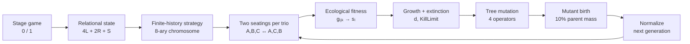

# Three-person coalition game

**Reconstructing Akiyama & Kaneko's artificial-life ecology, one source-anchored mechanism at a time.**

[Method](#6-method) · [Experiment](#7-experimental-design) · [Evidence](#8-results) · [Reproduce](#11-reproduction) · [Research manifesto](RESEARCH_MANIFESTO.md)

**Table 1 — Study at a glance**

| Field | Current state |
|:---|:---|
| Study status | **Exploratory** |
| Milestone | **M3c** — three 25-generation trajectories completed |
| Supported claim | The reconstructed ecology evolves across generations, but the current Reconstructed nine-species cap rule materially constrains mutation; historical long-run regimes are **not yet reproduced** |
| Verification | `python -m unittest discover -s tests -v` |
| Exploratory experiment | `python -m experiments.m3c_25_generations` |

## Abstract

This repository reconstructs the artificial-life model developed by Eizo Akiyama and Kunihiko Kaneko to study coalition structure, communication, exploitation, cooperation, and role differentiation in an iterated three-person game. Three players repeatedly choose between two symmetric actions. When exactly two actions match, those players receive a payoff and the third receives none. Strategies use finite histories of relational states and are encoded by an 8-ary chromosome. Strategy classes form species whose population shares change through ecological fitness, extinction, and mutation.

M1–M3b reconstructed and integrated the stage game, finite-history strategy, two-seating repeated interaction, explicit chromosome, ecological fitness, relative selection, extinction, historical mutation operators, initialization, and mutant birth. **M3c is the first short multi-generation exploration:** three fixed seed pairs are followed for 25 generations at the historical 1000-round interaction length.

The main result of this exploratory step is methodological rather than historical. All three trajectories reach the maximum of nine species by generation 3 or 4. Under the current Reconstructed rule — block a novel mutant when the population is already full — **504 novel mutant proposals are blocked while only 61 are admitted** across the three runs. One run also enters a zero-payoff ecology by generation 2. These observations show that the ecology is dynamically active, but they also show that the cap bookkeeping is too consequential to leave unexamined before a frozen historical replication.

## 1. Research question

**Does a faithful reconstruction reproduce the reported transition from class differentiation to temporal role differentiation and, later, diversified coalition/communication regimes?**

M3c asks a narrower diagnostic question first:

> **Does the reconstructed ecology remain evolutionarily active for 25 generations, and do our explicitly Reconstructed bookkeeping choices materially shape those trajectories?**

## 2. Why this matters

The model is unusually attractive for artificial-life approaches to international relations because **coalition structure is endogenous**. Coalition membership, exclusion, role allocation, and communication emerge from decentralized interaction rather than being hard-coded as a permanent alliance graph.

The scientific route remains deliberately staged: recreate the historical artificial ecology first; then recombine it with later sourced mechanisms; only afterward consider a genuinely new computational-IR model.

## 3. Contributions at the current stage

1. **Source reconstruction.** Original papers, a detailed Japanese exposition, and Akiyama's thesis are translated into an executable mechanism with provenance labels.
2. **Multi-generation executable ecology.** The historical-style causal chain now runs repeatedly rather than for only one generation.
3. **Diagnostic evidence.** Three short trajectories expose where the remaining Reconstructed bookkeeping choices actually matter.
4. **Exact computational acceleration.** Finite deterministic cycles and previously evaluated strategy matchups are reused without approximating the model.
5. **Executable-paper structure.** Question, method, evidence, interpretation, limitations, and reproduction remain visible in the repository itself.

## 4. Primary sources

- **Akiyama & Kaneko (1995)** — *Evolution of Cooperation, Differentiation, Complexity, and Diversity in an Iterated Three-Person Game*, *Artificial Life* 2(3), 293–304.
- **Akiyama & Kaneko (Artificial Life V)** — *Evolution of Communication and Strategies in an Iterated Three-Person Game*.
- **Akiyama (1995)** — *三人ゲームにおける協力の発生とその進化*, the detailed contemporary Japanese exposition used for repeated-game order, initialization, mutation transfer, and historical parameters.
- **Akiyama (1998)** — doctoral thesis, especially the chapter describing the dynamic three-person game, population fitness, and mutation operators.

See [REPLICATION_PROTOCOL.md](REPLICATION_PROTOCOL.md), [M3_SOURCE_RECONSTRUCTION.md](M3_SOURCE_RECONSTRUCTION.md), and [M3B_SOURCE_RECONSTRUCTION.md](M3B_SOURCE_RECONSTRUCTION.md).

## 5. Research objectives

**Table 2 — Replication objectives**

| ID | Objective | Operational test | Current status |
|:---|:---|:---|:---|
| R1 | Reconstruct stage game | Exhaust all 8 action profiles | **Implemented** |
| R2 | Reconstruct finite-history strategy | Source examples + deterministic trajectories | **Implemented** |
| R3 | Reconstruct evolutionary population dynamics | Source equations + mutation + species turnover | **25-generation exploratory trajectories run** |
| R4 | Reproduce historical evolutionary regimes | Frozen multi-seed experiment with objective diagnostics | Not yet run |
| R5 | Separate replication from later extension | Explicit Stage 1/2/3 provenance | Active |

## 6. Method



### 6.1 Stage game and relational state

$$
\mathrm{state}=4L+2R+S.
$$

Exactly two matching actions earn `3` each; the excluded player earns `0`. Unanimous profiles yield `0` for all three.

### 6.2 Finite-history strategy

The strategy is an 8-ary tree of finite state sequences. History is read most-recent-first. Card `1` is selected when the available history and at least one maximal gene are reciprocal-prefix compatible; otherwise the strategy selects `0`. The first action is stored separately.

### 6.3 Historical two-seating interaction

Each three-strategy matchup is played for `1000` rounds, then the two partner positions are exchanged and a second fresh `1000`-round interaction is played.

### 6.4 Ecological fitness

For focal species `i` and partner species `j,k`,

$$
s_i=\sum_j\sum_k g_{ijk}x_jx_k,
$$

with own-species partners included. Population mean and relative fitness are

$$
\bar{s}=\sum_i x_i s_i,
\qquad
w_i=s_i-\bar{s}.
$$

Population growth is

$$
x_i(t+1)-x_i(t)=d\,w_i\,x_i(t),
\qquad d=0.2.
$$

A below-average species that falls below `KillLimit = 0.2` is removed.

### 6.5 Mutation and mutant birth

The historical chromosome mutates through `PointAdd`, `PointRemove`, `Dupli`, and `RemoveRecursively`. An admitted mutant receives

$$
0.10\,x_{parent}
$$

of its parent's post-selection population, and the parent loses exactly that amount. Final normalization follows mutation transfer.

### 6.6 Exact computational acceleration for M3c

A 25-generation trajectory repeatedly evaluates deterministic 1000-round matchups. M3c makes this practical without changing the experiment:

- **cycle skipping:** a finite-memory deterministic interaction is in exactly the same future state whenever the same joint finite-history state recurs; complete repeated cycles can therefore be skipped exactly;
- **payoff caching:** `g_ijk` depends on the three strategies, not their current population frequencies, so a previously evaluated strategy triple can be reused in later generations.

These are computational equivalences, not new mechanisms or approximate shortcuts. The accelerated matchup evaluator is tested against explicit round-by-round execution.

## 7. Experimental design

### M3c — 25 generations × three seed pairs

**Table 3 — M3c configuration**

| Component | Value | Provenance |
|:---|:---|:---|
| generations | `25` | exploratory design |
| seed pairs `(initial, mutation)` | `(7,11)`, `(17,23)`, `(29,31)` | reproducibility choices |
| initial species | `6` | **Exact** |
| initial population each | `1/6` | **Exact** |
| initial memory length | `1` | **Exact** |
| root-branch probability | `0.5` | **Reconstructed** |
| first-action probability | `0.5` | **Reconstructed** |
| rounds per seating | `1000` | **Exact** |
| seatings per matchup | `2` | **Exact** |
| growth constant | `0.2` | **Exact** |
| `KillLimit` | `0.2` | **Exact** |
| mutant share | `0.10` | **Exact** |
| maximum species | `9` | **Exact** |
| novel mutant at full cap | blocked | **Reconstructed** |
| outer mutation scheduler | one local pass per surviving species | **Reconstructed** |

For every generation the experiment records species count and frequencies, dominant frequency, frequency entropy, ecological score range and mean, extinctions, mutation outcomes, chromosome node counts, and maximum memory depth.

This is **exploratory diagnostics**, not the frozen historical replication.

## 8. Results

### 8.1 Three exploratory trajectories

**Table 4 — M3c trajectory summary**

| Seeds | Cap first reached | Extinctions | New mutants | Merged | Blocked at cap | Final mean score | Final dominant share | Final max depth |
|:---|---:|---:|---:|---:|---:|---:|---:|---:|
| `7 / 11` | gen `4` | `12` | `15` | `0` | `184` | `1.5141` | `0.3118` | `2` |
| `17 / 23` | gen `3` | `4` | `7` | `2` | `187` | `0.0000` | `0.3715` | `3` |
| `29 / 31` | gen `4` | `36` | `39` | `0` | `133` | `0.8209` | `0.4348` | `3` |

Across the three trajectories, **504 novel mutant proposals are blocked at the nine-species cap**, compared with **61 admitted novel mutants** and **2 merges**.

This is the clearest M3c result: the current Reconstructed cap rule is not a rarely visited edge case. It becomes active almost immediately and then governs a large fraction of mutation proposals.

### 8.2 Three qualitatively different trajectories

The runs do not merely repeat one deterministic story:

- `7 / 11` reaches capacity at generation 4, undergoes 12 extinctions, and finishes with a mean score around `1.51`;
- `17 / 23` reaches capacity at generation 3 and enters a **zero-payoff ecology by generation 2**, remaining at mean score `0` through generation 25 under this seeded reconstruction;
- `29 / 31` is more turnover-heavy, with 36 extinctions and 39 admitted novel mutants, and finishes with a mean score around `0.82`.

The zero-payoff trajectory is an exploratory observation from one seed pair, not a claim that the historical model generically collapses.

### 8.3 Evidence artifacts

- [`evidence/m3c_25_generation_summary.json`](evidence/m3c_25_generation_summary.json) — compact cross-run summary;
- [`evidence/m3c_seed_7_diagnostics.csv`](evidence/m3c_seed_7_diagnostics.csv) — all generations for seed pair `7/11`;
- [`evidence/m3c_seed_17_diagnostics.csv`](evidence/m3c_seed_17_diagnostics.csv) — all generations for `17/23`;
- [`evidence/m3c_seed_29_diagnostics.csv`](evidence/m3c_seed_29_diagnostics.csv) — all generations for `29/31`.

### 8.4 Historical evolutionary result

**Not yet evaluated.** Class differentiation, temporal differentiation, period-`3n` societies, regime replacement, and later diversity remain the Stage-1 replication targets.

## 9. Interpretation

M3c did exactly what an exploratory pilot should do: it exposed a consequential uncertainty **before** we froze a larger experiment.

The ecology clearly supports sustained generation-to-generation selection, extinction, mutation, species birth, and increasing chromosome depth. But the current rule for what happens at nine species is invoked so often that it can no longer be treated as harmless bookkeeping. If we proceeded directly to M4, a substantial part of the apparent evolutionary dynamics could be an artifact of our Reconstructed cap handling rather than Akiyama & Kaneko's historical implementation.

That makes the next scientific move unusually clear: **do not choose the cap rule that gives the prettiest historical-looking trajectory. Resolve it from sources if possible; otherwise compare a very small set of defensible reconstructions under matched seeds.**

## 10. Limitations and threats to validity

The priority ordering of remaining uncertainties has changed because of M3c:

1. **nine-species cap bookkeeping** — now demonstrated to be highly active and therefore the immediate validity threat;
2. **outer mutation scheduler** — still Reconstructed and potentially consequential;
3. **random memory-1 initialization / first-action generator** — Reconstructed;
4. **combined mutation-operator order** — Reconstructed;
5. **historical seeds / run count** — unresolved;
6. **objective diagnostics for class vs temporal differentiation and later diversity** — must be frozen before M4.

The source-defined causal mechanisms remain present. These are reconstruction and sensitivity questions, not reasons to replace the model.

## 11. Reproduction

No external dependency is required.

```bash
git clone https://github.com/ReloadLightly/three-person-coalition-game.git
cd three-person-coalition-game
python -m unittest discover -s tests -v
python -m experiments.m3c_25_generations
```

The M3c command deterministically regenerates the compact summary and three per-seed diagnostic CSVs from the fixed seed pairs.

## 12. Repository map

**Table 5 — Scientific artifact map**

| Path | Scientific role |
|:---|:---|
| `README.md` | Compact executable paper |
| `RESEARCH_MANIFESTO.md` | recreate → recombine → invent |
| `REPLICATION_PROTOCOL.md` | current source-to-model and experiment contract |
| `M3_SOURCE_RECONSTRUCTION.md` | pre-M3a ecological/mutation reconstruction |
| `M3B_SOURCE_RECONSTRUCTION.md` | initialization, positional swap, mutant-birth reconstruction |
| `three_person_coalition_game/game.py` | M1 stage game |
| `three_person_coalition_game/strategy.py` | M2 finite-history phenotype |
| `three_person_coalition_game/interaction.py` | bounded-memory synchronous interaction |
| `three_person_coalition_game/chromosome.py` | explicit 8-ary tree + mutation operators |
| `three_person_coalition_game/ecology.py` | two-seating fitness + exact cycle/cache acceleration |
| `three_person_coalition_game/evolution.py` | initialization + repeated generation integration |
| `experiments/m3b_one_generation.py` | one-generation integration check |
| `experiments/m3c_25_generations.py` | three 25-generation exploratory trajectories |
| `evidence/m3b_one_generation.json` | raw M3b integration evidence |
| `evidence/m3c_25_generation_summary.json` | M3c cross-run summary |
| `evidence/m3c_seed_*_diagnostics.csv` | generation-by-generation M3c diagnostics |
| `tests/` | source examples and scientific invariants |

## 13. Citation

Akiyama, E., & Kaneko, K. (1995). *Evolution of Cooperation, Differentiation, Complexity, and Diversity in an Iterated Three-Person Game*. *Artificial Life*, 2(3), 293–304.

A project-specific `CITATION.cff` will be added when the historical replication reaches a citable release.

## 14. Next bounded step

**M3d — resolve or sensitivity-test the nine-species cap rule before M4.**

First search the detailed sources once more for the original full-cap behavior. If it remains unavailable, compare only a small set of defensible cap reconstructions under identical initial seeds, mutation streams, and historical mechanisms. The purpose is not to find the variant that resembles the paper most closely; it is to determine whether the historical replication claim is robust to this unavoidable reconstruction choice.
