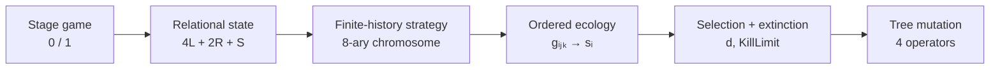

# Three-person coalition game

> **Reconstructing Akiyama & Kaneko's three-person artificial-life ecology from the stage game upward — one source-anchored mechanism at a time.**

> **Study status:** Protocol / implementation validation  
> **Standard:** Scientific Repository Standard v1.0.0  
> **Research ladder:** [recreate → recombine → invent](RESEARCH_MANIFESTO.md)  
> **Current milestone:** **M3a — evolutionary core implemented**  
> **Primary claim:** the historical stage game, finite-history strategy, ordered ecological fitness, selection/extinction, and four tree-mutation mechanisms are now executable; **no evolutionary replication result is claimed yet**  
> **Reproduction:** `python -m unittest discover -s tests -v`

## Abstract

This repository reconstructs the artificial-life model developed by Eizo Akiyama and Kunihiko Kaneko to study how coalition structure, communication, exploitation, cooperation, and role differentiation can emerge in an iterated three-person game. Three players repeatedly choose between two initially meaningless actions. Exactly two matching players can form a payoff-producing subgroup only by excluding the third. Strategies are finite-history response codes represented by an 8-ary tree; strategy classes form species whose population shares change through relative fitness, extinction, and mutation.

The project follows a strict research ladder. **Stage 1 recreates** the historical experiment, reconstructing missing implementation details and estimating missing numerical values without inventing new mechanisms. **Stage 2 will recombine** the trusted reconstruction with mechanisms from later published work. **Stage 3 may invent** new mechanisms only after the first two stages teach us where genuine theoretical gaps lie.

M3a implements the source-recovered evolutionary core but deliberately stops before a full evolutionary run. Random historical initialization and mutant-species insertion/turnover still require a final bounded reconstruction before the first population trajectory is scientifically meaningful.

## 1. Research question

> **Does a faithful reconstruction of Akiyama & Kaneko's three-person evolutionary game reproduce the reported transition from class differentiation to temporal role differentiation and, later, diversified coalition/communication regimes?**

A later computational-IR extension may ask whether related mechanisms illuminate coalition formation and flexible alignment in decentralized international systems. That is explicitly outside the current replication claim.

## 2. Why this matters

The model is unusually attractive for artificial-life approaches to international relations because **coalition structure is endogenous**. With three actors, coalition membership, exclusion, role allocation, and communication can change through decentralized interaction rather than being imposed by a central planner or fixed network.

The scientific opportunity is not to rename the agents "Japan", "China", and "United States". It is to understand the smallest mechanism first, reproduce its dynamics, then deliberately ask which later mechanisms are worth recombining with it.

## 3. Contributions at the current stage

1. **Source reconstruction.** A line-of-descent from the original papers and thesis to an executable model, with Exact and Reconstructed components separated explicitly.
2. **Minimal executable method.** M1–M3a implement only mechanisms already justified by the historical model.
3. **Research artifact.** The repository is organized as an executable paper: question → mechanism → validation → result boundary → reproduction.

There is **no empirical contribution yet** because the historical evolutionary phenomena have not yet been rerun.

## 4. Primary sources

- **Akiyama & Kaneko (1995)** — *Evolution of Cooperation, Differentiation, Complexity, and Diversity in an Iterated Three-Person Game*, *Artificial Life* 2(3), 293–304.
- **Akiyama & Kaneko (Artificial Life V)** — *Evolution of Communication and Strategies in an Iterated Three-Person Game*.
- **Akiyama (1995)** — *三人ゲームにおける協力の発生とその進化*, a detailed contemporary Japanese exposition.
- **Akiyama (1998)** — doctoral thesis, especially the chapter describing the three-person dynamic game, its population fitness, and mutation operators.

See [REPLICATION_PROTOCOL.md](REPLICATION_PROTOCOL.md) for the source-to-model contract and [M3_SOURCE_RECONSTRUCTION.md](M3_SOURCE_RECONSTRUCTION.md) for the bounded reconstruction that preceded M3 implementation.

## 5. Research objectives

| ID | Objective | Operational test | Current status |
|:---|:---|:---|:---|
| R1 | Reconstruct the stage game | Exhaust all 8 action profiles | **Implemented** |
| R2 | Reconstruct finite-history strategy semantics | Source examples + deterministic trajectories | **Implemented** |
| R3 | Reconstruct ecological selection and tree mutation | Ordered fitness + source-defined mutation operators | **M3a implemented** |
| R4 | Reproduce historical evolutionary regimes | Frozen multi-seed experiment | Not run |
| R5 | Separate replication from later extension | Explicit Stage 1/2/3 provenance | Active |

## 6. Method



### 6.1 Stage game — M1

For a focal player the state is the binary integer

\[
\text{state}=4L+2R+S,
\]

where `L`, `R`, and `S` are the left, right, and self actions. If exactly two actions match, that pair receives `3` each and the excluded player receives `0`; unanimous profiles give everyone `0`.

### 6.2 Finite-history strategy — M2

The historical strategy is an **8-ary tree** of finite state sequences. The focal player's history is read most-recent-first. Card `1` is chosen when the available history and at least one maximal tree gene are compatible by reciprocal prefix matching; otherwise card `0` is chosen. The first-round action is stored separately.

M2 implements the behaviorally sufficient maximal-gene representation and a synchronous fixed-position repeated interaction.

### 6.3 Explicit chromosome topology — M3a

M3 mutation requires branch topology, so `chromosome.py` stores the prefix-closed explicit 8-ary tree while preserving exact conversion back to M2 action semantics.

| Mutation | Historical rate | Structural action | Provenance |
|:---|---:|:---|:---|
| `PointAdd` | `0.1` | add one absent branch | mechanism **Exact**; candidate enumeration **Reconstructed** |
| `PointRemove` | `0.1` | remove a terminal branch | **Exact** |
| `Dupli` | `0.001` | attach all 8 children to a terminal | **Exact**; neutral at creation |
| `RemoveRecursively` | `0.001` | remove a branch and its full subtree | mechanism **Exact**; graph targeting **Reconstructed** |

Historical maximum tree depth: `4`.

The sources do not unambiguously specify how multiple operator types are globally ordered within one mutation pass. The implementation therefore exposes the current order as **Reconstructed** rather than disguising it as historical fact:

`PointAdd → PointRemove → Dupli → RemoveRecursively`.

### 6.4 Ordered ecological fitness — M3a

For focal species `i`, left partner species `j`, and right partner species `k`,

\[
g_{ijk}
\]

is the focal player's average payoff per round in the deterministic repeated interaction. Partner slots remain ordered because left/right are strategy inputs.

Species score is

\[
s_i=\sum_j\sum_k g_{ijk}x_jx_k,
\]

including own-species partners. Population mean and relative fitness are

\[
\bar{s}=\sum_i x_i s_i,
\qquad
w_i=s_i-\bar{s}.
\]

The source-recovered population update is

\[
x_i(t+1)-x_i(t)=d\,w_i\,x_i(t),
\]

with historical baseline `d = 0.2`, followed by normalization. A below-average species that falls below `KillLimit = 0.2` is removed.

The current implementation evaluates extinction after the growth step and before survivor normalization; that timing is explicitly labeled **Reconstructed**.

## 7. Experimental design

M3a is still an implementation-validation milestone, not the historical replication experiment.

**Historical baseline already recovered:** interaction length `1000`, maximum memory `4`, six initial memory-1 species, maximum species count `9`, `d = 0.2`, `KillLimit = 0.2`, and the four mutation rates above.

**Still required before the first evolutionary run:**

- exact or reconstructed random memory-1 initialization distribution;
- exact or reconstructed rule by which mutation creates/replaces species in the bounded species population;
- a frozen seed plan;
- objective diagnostics for class differentiation, temporal differentiation, and later diversity.

We will not run a seductive but scientifically uninterpretable population simulation before those are fixed.

## 8. Results

### 8.1 Implementation-validation result

The repository now contains executable mechanisms for:

- all eight stage-game profiles and relational state indexing;
- finite-history action selection;
- synchronous repeated interaction;
- explicit 8-ary chromosome topology;
- all four historical mutation mechanisms;
- every ordered species triple `g_ijk`;
- population-weighted species scores `s_i`;
- relative-fitness population growth;
- extinction and normalization.

The M3 tests add direct checks for explicit tree topology, each mutation operator, `Dupli` phenotype neutrality, ordered species triples, population weighting, growth, and extinction.

### 8.2 Evolutionary result

**None yet.**

The repository does not yet claim to reproduce class differentiation, temporal differentiation, period-`3n` societies, or diversification. Those remain the experiment we are building toward.

## 9. Interpretation

The model now has all of the core causal layers needed for an artificial ecology: remembered relational interaction creates payoffs; payoffs are integrated over the current population; relative performance changes species abundance; extinction removes unsuccessful strategies; and mutation changes the communication code itself.

The most interesting structural feature at this stage is `Dupli`: the tree can gain new evolutionary degrees of freedom without immediately changing behavior. That gives later selection something new to work on while preserving the current phenotype.

## 10. Limitations and threats to validity

The largest remaining validity risk is **species turnover**, not missing equations. We know that strategies mutate and species appear/disappear, but the exact historical bookkeeping that inserts mutant chromosomes into the bounded species ecology still needs to be pinned down or transparently reconstructed.

Other remaining issues are random initialization, multi-operator ordering sensitivity, original random seeds/run count, and objective regime classification. None justifies omitting a known mechanism.

A successful historical replication will establish behavior of this artificial ecology. It will not, by itself, validate a model of real states, alliances, or geopolitics.

## 11. Reproduction

No external dependency is required.

```bash
git clone https://github.com/ReloadLightly/three-person-coalition-game.git
cd three-person-coalition-game
python -m unittest discover -s tests -v
```

The suite now contains focused M1–M3a tests; test count is subordinate to the scientific invariants they protect.

## 12. Repository map

| Path | Scientific role |
|:---|:---|
| `README.md` | Compact executable paper |
| `RESEARCH_MANIFESTO.md` | Portfolio research ladder: recreate → recombine → invent |
| `REPLICATION_PROTOCOL.md` | Source-to-model contract and provenance boundary |
| `M3_SOURCE_RECONSTRUCTION.md` | Evidence reconstruction performed before M3 code |
| `three_person_coalition_game/game.py` | M1 stage game |
| `three_person_coalition_game/strategy.py` | M2 finite-history phenotype |
| `three_person_coalition_game/interaction.py` | M2 synchronous repeated interaction |
| `three_person_coalition_game/chromosome.py` | M3a explicit tree + four mutation operators |
| `three_person_coalition_game/ecology.py` | M3a ordered fitness + selection/extinction |
| `tests/` | Source examples and scientific invariants |
| `SCIENTIFIC_REPOSITORY_STANDARD.md` | Governing repository standard |

## 13. Citation

Akiyama, E., & Kaneko, K. (1995). *Evolution of Cooperation, Differentiation, Complexity, and Diversity in an Iterated Three-Person Game*. *Artificial Life*, 2(3), 293–304.

A project-specific `CITATION.cff` will be added when the historical replication reaches a citable release.

## 14. License and responsible use

A repository license has not yet been selected. No downstream policy or geopolitical claim is supported by the current artifact.

---

## Next bounded step

**M3b — species birth/turnover + historical initialization reconstruction, followed by one deterministic generation only.**

The stopping condition is simple: we should be able to explain exactly how a mutant chromosome becomes a species and how the six initial memory-1 species are sampled before we allow the ecology to run across generations.
