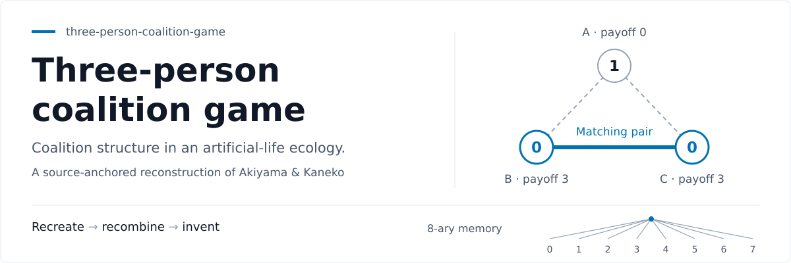
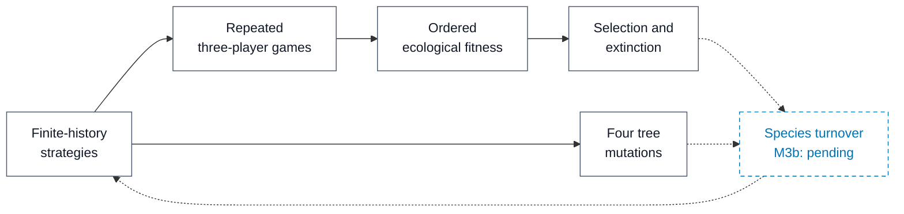

<p align="center">
  
</p>

# Three-person coalition game

**Reconstructing Akiyama & Kaneko's artificial-life ecology, one source-anchored mechanism at a time.**

[Method](#6-method) · [Evidence](#8-results) · [Reproduce](#11-reproduction) · [Research manifesto](RESEARCH_MANIFESTO.md)

**Table 1 — Study at a glance**

| Field | Current state |
|:---|:---|
| Study status | **Protocol** — implementation validation |
| Milestone | **M3a** — evolutionary core implemented; full generation loop pending |
| Supported claim | Core mechanisms are executable; historical evolutionary outcomes are **not yet reproduced** |
| Verification command | `python -m unittest discover -s tests -v` |

*Reading:* This is a reconstruction in progress, not a completed replication. The banner illustrates the game rule; it is not a simulation result.

## Abstract

This repository reconstructs the artificial-life model developed by Eizo Akiyama and Kunihiko Kaneko to study coalition structure, communication, exploitation, cooperation, and role differentiation in an iterated three-person game. Three players repeatedly choose between two symmetric actions. When exactly two actions match, those players receive a payoff and the third receives none. Strategies use finite histories of relational states and are represented by an 8-ary chromosome. Strategy classes form species; their scores depend on the current population, while selection, extinction, and mutation change the ecology.

The current implementation includes the stage game, finite-history decisions, synchronous repeated interactions, ordered ecological fitness, selection/extinction, and four tree-mutation operators. These components have focused validation tests, but the historical evolutionary experiment has not been rerun. Initialization and mutant-species insertion/turnover remain the next implementation step.

The research follows **recreate → recombine → invent**: preserve sourced mechanisms, reconstruct unavailable implementation details transparently, and distinguish later extensions from historical replication. A future international-relations application motivates the project but is not a claim established by the present artifact.

## 1. Research question

**Does a faithful reconstruction reproduce the reported transition from class differentiation to temporal role differentiation and, later, diversified coalition/communication regimes?**

The immediate question is narrower: can the mechanisms needed for that experiment be reconstructed and checked without replacing them with unrelated machinery?

## 2. Why this matters

Coalition membership is an outcome of interaction rather than a fixed alliance imposed at initialization. The same minimal game therefore provides a setting for investigating exclusion, changing partners, and the coordination of roles.

This motivates a possible computational-IR extension, not a direct identification of players with countries. We first reconstruct the artificial ecology, then examine whether mechanisms from other research can be meaningfully recombined with it. See the [research manifesto](RESEARCH_MANIFESTO.md).

## 3. Contributions

The present contributions are a **source-to-model reconstruction** and a **small executable method**. The protocol distinguishes recovered rules from inferred implementation choices; the code implements the M1–M3a components with tests tied to their scientific invariants.

There is no new evolutionary finding or validated geopolitical theory at this stage.

## 4. Related work and primary sources

The source record comprises Akiyama & Kaneko's *Evolution of Cooperation, Differentiation, Complexity, and Diversity in an Iterated Three-Person Game* (*Artificial Life*, 1995); their *Evolution of Communication and Strategies in an Iterated Three-Person Game* (*Artificial Life V*); Akiyama's 1995 Japanese exposition, *三人ゲームにおける協力の発生とその進化*; and his 1998 doctoral thesis.

The [replication protocol](REPLICATION_PROTOCOL.md) records how these sources inform the model. The [M3 source reconstruction](M3_SOURCE_RECONSTRUCTION.md) records the fitness and mutation reconstruction that preceded M3a. **Exact**, **Reconstructed**, and **Estimated** describe Stage-1 provenance; **Recombined** and **Novel** are reserved for later research stages.

## 5. Research objectives

**Table 2 — Objectives and evidence required**

| ID | Objective | Validation target | Status |
|:---|:---|:---|:---|
| R1 | Recover the stage game | All eight profiles and relational state indices | Implemented |
| R2 | Recover history-dependent decisions | Source examples and deterministic interactions | Implemented |
| R3 | Recover evolutionary machinery | Ordered fitness, selection/extinction, tree mutation | Core implemented; turnover pending |
| R4 | Reproduce reported regimes | Frozen multi-seed experiment | Not run |
| R5 | Separate replication from extensions | Explicit provenance and stage boundaries | Ongoing |

*Reading:* Implementation of R1–R3 does not establish the evolutionary outcomes in R4.

## 6. Method



*Figure 1 — Components of the reconstructed ecology.* Solid links connect implemented components. Dashed links mark the pending integration through species turnover; they do not represent an already running evolutionary loop.

### 6.1 Stage game and relational state

From a focal player's perspective, $L$, $R$, and $S$ are the binary actions of the left partner, right partner, and self. The eight states are encoded as

$$
\mathrm{state}=4L+2R+S.
$$

Exactly two matching players receive $3$ each; the excluded player receives $0$. If all three actions match, all payoffs are $0$. Neither action intrinsically means cooperation or defection. Implementation: [`game.py`](three_person_coalition_game/game.py).

### 6.2 Finite-history decisions

The strategy reads its focal-state history most-recent-first. It chooses card $1$ when that history and at least one maximal gene are related by a prefix in either direction; otherwise it chooses card $0$. The first action is stored separately.

[`strategy.py`](three_person_coalition_game/strategy.py) stores maximal gene paths for action selection. [`interaction.py`](three_person_coalition_game/interaction.py) selects all three actions from prior histories before appending the current round's states. [`chromosome.py`](three_person_coalition_game/chromosome.py) preserves the explicit prefix-closed topology needed for mutation.

### 6.3 Tree mutation

**Table 3 — Mutation operators in the current reconstruction**

| Operator | Reported local rate | Structural action | Provenance boundary |
|:---|---:|:---|:---|
| `PointAdd` | 0.100 | Add an absent branch | Mechanism Exact; candidate enumeration Reconstructed |
| `PointRemove` | 0.100 | Remove a terminal branch | Exact mechanism |
| `Dupli` | 0.001 | Attach all eight children to a terminal | Exact mechanism; behavior-neutral at creation |
| `RemoveRecursively` | 0.001 | Remove a branch and its descendants | Mechanism Exact; graph targeting Reconstructed |

*Reading:* Rates and operators follow the existing source reconstruction. The implementation order, `PointAdd → PointRemove → Dupli → RemoveRecursively`, is **Reconstructed**, not recovered historical code. Maximum tree depth is $4$ in the current baseline.

### 6.4 Ecological fitness and population update

Let $g_{ijk}$ denote the focal species-$i$ player's average payoff per round when playing with left species $j$ and right species $k$. With population fractions $x_j$ and $x_k$, its score is

$$
s_i=\sum_j\sum_k g_{ijk}x_jx_k.
$$

The partner slots are ordered and own-species partners are included. The population mean and relative fitness are

$$
\bar{s}=\sum_i x_i s_i,
\qquad
w_i=s_i-\bar{s}.
$$

The growth update is

$$
x_i(t+1)-x_i(t)=d\,w_i\,x_i(t),
\qquad d=0.2.
$$

A below-average species falling below `KillLimit = 0.2` is removed. The current implementation checks extinction after growth and before survivor normalization; this timing is **Reconstructed**. These equations and choices are implemented in [`ecology.py`](three_person_coalition_game/ecology.py) and documented in the [protocol](REPLICATION_PROTOCOL.md).

## 7. Experimental design

**Current scope:** implementation validation only. The existing baseline records $1{,}000$ rounds per interaction, maximum memory $4$, six initial memory-1 species, maximum nine species, and the growth, extinction, and mutation values above.

The next bounded step is **M3b: initialization and species turnover, followed by one transparent generation**. Unavailable historical coding details will be reconstructed and labeled, not treated as reasons to omit a known mechanism. Multi-generation replication requires a declared seed plan and measurable diagnostics for the reported regimes.

The visual design pass changes neither this protocol nor the model. It introduces no new experiment or result.

## 8. Results

### 8.1 Implementation evidence

**Table 4 — What can presently be inspected**

| Component | Evidence in the repository | Claim boundary |
|:---|:---|:---|
| Stage game | [Profile, symmetry, and payoff checks](tests/test_game.py) | One-round mechanism |
| Finite-history strategy | [Source examples and prefix checks](tests/test_strategy.py) | Decision semantics |
| Repeated interaction | [Orientation and repeated-play checks](tests/test_interaction.py) | Fixed-position interaction |
| Chromosome and mutation | [Topology, operators, and neutrality checks](tests/test_chromosome.py) | Mutation components |
| Ecological selection | [Ordered fitness, weighting, and extinction checks](tests/test_ecology.py) | Selection components |
| Historical evolutionary outcomes | No replication runs yet | No outcome claim |

*Reading:* These links identify the existing checks, not a newly executed test run. No model tests or experiments were run for this documentation-only design pass.

### 8.2 Evolutionary evidence

**No evolutionary replication results are reported.** Class differentiation, temporal differentiation, period-$3n$ societies, and later diversification remain targets. No generated figure is presented as evidence of those outcomes.

## 9. Interpretation

Fitness is ecological: a strategy's performance depends on the current population, not only on a fixed opponent. The chromosome also separates structure from immediate behavior. In the recovered `Dupli` rule, replacing a terminal gene with all eight continuations preserves the current decisions while creating separately mutable branches.

These features motivate the experiment. They do not establish that its reported evolutionary sequence has been reproduced, nor that the artificial ecology describes real international politics.

## 10. Limitations and threats to validity

Species birth/insertion and random initialization remain to be reconstructed or explicitly specified. Mutation-order sensitivity, extinction timing, historical run comparability, and regime classification also remain relevant limitations.

Recovering a mechanism, implementing it, passing a component check, and reproducing an evolutionary result are distinct achievements. The research manifesto permits transparent reconstruction and parameter exploration; it does not permit presenting those choices as recovered source facts.

## 11. Reproduction

The current model and tests require no third-party Python dependency. From a checkout:

```bash
git clone https://github.com/ReloadLightly/three-person-coalition-game.git
cd three-person-coalition-game
python -m unittest discover -s tests -v
```

This runs the component checks. There is not yet a command reproducing the historical evolutionary findings.

## 12. Repository map

```text
README.md                        Compact scientific paper
RESEARCH_MANIFESTO.md             Recreate → recombine → invent
SCIENTIFIC_REPOSITORY_STANDARD.md Governing repository standard
REPLICATION_PROTOCOL.md          Source-to-model contract
M3_SOURCE_RECONSTRUCTION.md       Fitness and mutation reconstruction
README_VISUAL_SYSTEM.md           Reusable presentation pattern
assets/hero.svg                   Mechanism-based title graphic
three_person_coalition_game/      Executable method
  game.py                        Stage game and state index
  strategy.py                    Finite-history decisions
  interaction.py                 Synchronous repeated play
  chromosome.py                  Explicit tree and mutations
  ecology.py                     Fitness and selection/extinction
tests/                           Source examples and invariants
```

## 13. Citation

Akiyama, E., & Kaneko, K. (1995). *Evolution of Cooperation, Differentiation, Complexity, and Diversity in an Iterated Three-Person Game*. **Artificial Life, 2**(3), 293–304.

The other primary sources and reconstruction decisions are identified in the [protocol](REPLICATION_PROTOCOL.md). A project-specific `CITATION.cff` is deferred until a citable replication release.

## 14. License and responsible use

A repository license has not yet been selected. The current artifact supports no downstream policy claim. Presentation follows the adopted [Scientific Repository Standard](SCIENTIFIC_REPOSITORY_STANDARD.md), with the reusable banner, table, and equation conventions recorded in [README_VISUAL_SYSTEM.md](README_VISUAL_SYSTEM.md).

---

**Next scientific step: M3b.** Reconstruct initialization and mutant-species turnover, then inspect one generation. The full evolutionary run remains separate.
