# Three-person coalition game

**Reconstructing Akiyama & Kaneko's artificial-life ecology, one source-anchored mechanism at a time.**

[Method](#6-method) · [Experiment](#7-experimental-design) · [Evidence](#8-results) · [Reproduce](#11-reproduction) · [Research manifesto](RESEARCH_MANIFESTO.md)

**Table 1 — Study at a glance**

| Field | Current state |
|:---|:---|
| Study status | **Implementation validation / exploratory evidence** |
| Milestone | **M3b** — one full generation now executes end-to-end |
| Supported claim | One source-anchored generation runs from interaction through mutant birth; historical long-run regimes are **not yet reproduced** |
| Verification | `python -m unittest discover -s tests -v` |
| Bounded experiment | `python -m experiments.m3b_one_generation` |

## Abstract

This repository reconstructs the artificial-life model developed by Eizo Akiyama and Kunihiko Kaneko to study coalition structure, communication, exploitation, cooperation, and role differentiation in an iterated three-person game. Three players repeatedly choose between two symmetric actions. When exactly two actions match, those players receive a payoff and the third receives none. Strategies use finite histories of relational states and are encoded by an 8-ary chromosome. Strategy classes form species whose population shares change through ecological fitness, extinction, and mutation.

M1–M3a reconstructed the stage game, finite-history strategy, repeated interaction, explicit chromosome, ecological fitness, relative selection, extinction, and four historical mutation operators. **M3b now closes the generation loop:** each matchup is evaluated in both source-required partner seatings; six random memory-1 species begin at equal population `1/6`; surviving species generate mutant proposals; an admitted mutant receives exactly 10% of its parent's population; and normalization occurs after mutation.

The first evolutionary experiment deliberately runs **one generation only**. It is evidence that the causal pipeline executes, not evidence that the reported transitions to class differentiation, temporal differentiation, or later diversity have already been replicated.

## 1. Research question

**Does a faithful reconstruction reproduce the reported transition from class differentiation to temporal role differentiation and, later, diversified coalition/communication regimes?**

The current question is narrower: does one historically grounded generation transition execute correctly enough that we can now justify a short exploratory evolutionary trajectory?

## 2. Why this matters

The model is unusually attractive for artificial-life approaches to international relations because **coalition structure is endogenous**. Coalition membership, exclusion, role allocation, and communication emerge from decentralized interaction rather than being hard-coded as a permanent alliance graph.

The scientific route is therefore deliberately staged: first recreate the artificial ecology, then recombine it with later sourced mechanisms, and only afterward consider a genuinely new computational-IR model.

## 3. Contributions at the current stage

1. **Source reconstruction.** Original papers, a detailed Japanese exposition, and Akiyama's thesis are translated into an executable mechanism with provenance labels.
2. **Complete one-generation causal chain.** Interaction → ecological fitness → growth/extinction → mutation birth → normalization now runs end-to-end.
3. **Explicit uncertainty.** Historical facts and reconstructed bookkeeping choices remain visibly distinct.
4. **Executable-paper structure.** Question, method, evidence, interpretation, limits, and reproduction are kept in one scientific artifact.

## 4. Primary sources

- **Akiyama & Kaneko (1995)** — *Evolution of Cooperation, Differentiation, Complexity, and Diversity in an Iterated Three-Person Game*, *Artificial Life* 2(3), 293–304.
- **Akiyama & Kaneko (Artificial Life V)** — *Evolution of Communication and Strategies in an Iterated Three-Person Game*.
- **Akiyama (1995)** — *三人ゲームにおける協力の発生とその進化*, the detailed contemporary Japanese exposition used for repeated-game order, initialization, mutation transfer, and historical parameters.
- **Akiyama (1998)** — doctoral thesis, especially the chapter describing the dynamic three-person game, population fitness, and mutation operators.

See [REPLICATION_PROTOCOL.md](REPLICATION_PROTOCOL.md), [M3_SOURCE_RECONSTRUCTION.md](M3_SOURCE_RECONSTRUCTION.md), and [M3B_SOURCE_RECONSTRUCTION.md](M3B_SOURCE_RECONSTRUCTION.md).

## 5. Research objectives

**Table 2 — Replication objectives**

| ID | Objective | Operational test | Current status |
|:---|:---|:---|:---|
| R1 | Reconstruct stage game | Exhaust all 8 action profiles | **Implemented** |
| R2 | Reconstruct finite-history strategy | Source examples + deterministic trajectories | **Implemented** |
| R3 | Reconstruct evolutionary population dynamics | Source equations + mutation + species turnover | **One generation implemented** |
| R4 | Reproduce historical evolutionary regimes | Frozen multi-seed experiment | Not yet run |
| R5 | Separate replication from later extension | Explicit Stage 1/2/3 provenance | Active |

## 6. Method

```mermaid
flowchart LR
    A["Stage game<br/>0 / 1"] --> B["Relational state<br/>4L + 2R + S"]
    B --> C["Finite-history strategy<br/>8-ary chromosome"]
    C --> D["Two seatings per trio<br/>A,B,C ↔ A,C,B"]
    D --> E["Ecological fitness<br/>gᵢⱼₖ → sᵢ"]
    E --> F["Growth + extinction<br/>d, KillLimit"]
    F --> G["Tree mutation<br/>4 operators"]
    G --> H["Mutant birth<br/>10% parent mass"]
    H --> I["Normalize<br/>next generation"]
```



### 6.1 Stage game and relational state

$$
\mathrm{state}=4L+2R+S.
$$

Exactly two matching actions earn `3` each; the excluded player earns `0`. Unanimous profiles yield `0` for all three.

### 6.2 Finite-history strategy

The strategy is an 8-ary tree of finite state sequences. History is read most-recent-first. Card `1` is selected when the available history and at least one maximal gene are reciprocal-prefix compatible; otherwise the strategy selects `0`. The first action is stored separately.

### 6.3 Historical two-seating interaction

The detailed source does something we had not yet encoded in M3a: after `max-round` in one player order, two players exchange positions and the trio plays another `max-round`. M3b therefore evaluates both partner seatings with fresh histories.

### 6.4 Ecological fitness

For focal species `i` and partner species `j,k`,

$$
s_i=\sum_j\sum_k g_{ijk}x_jx_k,
$$

with own-species partners included. Population mean and relative fitness are

$$
\bar{s}=\sum_i x_i s_i,
\qquad
w_i=s_i-\bar{s}.
$$

Population growth is

$$
x_i(t+1)-x_i(t)=d\,w_i\,x_i(t),
\qquad d=0.2.
$$

A below-average species that falls below `KillLimit = 0.2` is removed.

### 6.5 Mutation and mutant birth

The historical chromosome mutates through `PointAdd`, `PointRemove`, `Dupli`, and `RemoveRecursively`. At generation change, a mutant receives

$$
0.10\,x_{parent}
$$

of its parent's post-selection population, and the parent loses exactly that amount. The population is normalized only after mutation transfer.

## 7. Experimental design

### M3b — one generation, then stop

The first integration experiment uses the historical baseline wherever recovered:

**Table 3 — M3b configuration**

| Component | Value | Provenance |
|:---|---:|:---|
| initial species | `6` | **Exact** |
| initial population each | `1/6` | **Exact** |
| initial memory length | `1` | **Exact** |
| root-branch probability | `0.5` | **Reconstructed** from generation-0 branch statistics |
| first-action probability | `0.5` | **Reconstructed** |
| rounds per seating | `1000` | **Exact** |
| seatings per trio | `2` | **Exact** |
| growth constant | `0.2` | **Exact** |
| `KillLimit` | `0.2` | **Exact** |
| mutant share | `0.10` | **Exact** |
| maximum species | `9` | **Exact** |
| novel mutant at full cap | blocked | **Reconstructed** |
| outer mutation scheduler | one local pass per surviving species | **Reconstructed** |
| initial seed | `7` | reproducibility choice |
| mutation seed | `11` | reproducibility choice |

The experiment is deliberately not a long evolutionary run. Its stopping condition is the first normalized next-generation population.

## 8. Results

### 8.1 Validation result

The combined M1–M3b suite passes **41 focused tests** in the local reproduction used for this commit. Tests protect source examples and scientific invariants rather than maximizing test count.

### 8.2 One-generation evidence

The bounded historical-style run starts from six equal-frequency memory-1 species. With seeds `7` and `11`, the six initial ecological scores are approximately:

$$
(1.5469,\ 1.4579,\ 1.2844,\ 1.3055,\ 1.2989,\ 1.6105).
$$

The population mean is approximately

$$
\bar{s}=1.41736.
$$

Species indices `2`, `3`, and `4` fall below the historical extinction rule in this generation. The three survivors each produce a distinct admitted mutant under the reconstructed mutation scheduler. After 10% parent-to-mutant transfer and final normalization, the six next-generation frequencies are approximately:

$$
(0.30050,\ 0.29528,\ 0.30422,\ 0.03339,\ 0.03281,\ 0.03380).
$$

Raw machine-readable evidence is stored in [`evidence/m3b_one_generation.json`](evidence/m3b_one_generation.json).

**This is an implementation-validation observation from one new seeded reconstruction run. It is not evidence that the authors' historical evolutionary trajectory has been replicated.**

### 8.3 Historical evolutionary result

**Not yet evaluated.** Class differentiation, temporal differentiation, period-`3n` societies, regime replacement, and later diversity remain the actual Stage-1 replication targets.

## 9. Interpretation

M3b is the first point where the repository contains an actual evolutionary transition rather than disconnected evolutionary ingredients. A population of strategies now plays, receives ecological fitness, changes abundance, loses weak species, produces mutants, and becomes the next normalized population.

The one-generation result also exposes the remaining scientific question cleanly: the long-run trajectory may depend on low-level reconstructed bookkeeping choices — especially the outer mutation scheduler and the behavior at the nine-species cap. Those choices should be stress-tested before we freeze a confirmatory historical replication.

## 10. Limitations and threats to validity

The remaining Stage-1 uncertainties are narrow but potentially consequential:

- exact historical outer mutation scheduler;
- exact historical behavior at the nine-species cap;
- exact initial first-action/random-tree PRNG;
- combined mutation-operator order;
- historical seeds/run count;
- objective diagnostics for the reported social regimes.

The source-defined mechanisms are present. These remaining details are therefore sensitivity questions, not reasons to delete or replace the mechanisms.

A successful historical replication will establish behavior of this artificial ecology. It will not by itself validate a model of real states, alliances, or geopolitics.

## 11. Reproduction

No external dependency is required.

```bash
git clone https://github.com/ReloadLightly/three-person-coalition-game.git
cd three-person-coalition-game
python -m unittest discover -s tests -v
python -m experiments.m3b_one_generation
```

The experiment rewrites [`evidence/m3b_one_generation.json`](evidence/m3b_one_generation.json) deterministically from the fixed seeds.

## 12. Repository map

**Table 4 — Scientific artifact map**

| Path | Scientific role |
|:---|:---|
| `README.md` | Compact executable paper |
| `RESEARCH_MANIFESTO.md` | recreate → recombine → invent |
| `REPLICATION_PROTOCOL.md` | current source-to-model contract |
| `M3_SOURCE_RECONSTRUCTION.md` | pre-M3a ecological/mutation reconstruction |
| `M3B_SOURCE_RECONSTRUCTION.md` | initialization, positional swap, mutant-birth reconstruction |
| `three_person_coalition_game/game.py` | M1 stage game |
| `three_person_coalition_game/strategy.py` | M2 finite-history phenotype |
| `three_person_coalition_game/interaction.py` | bounded-memory synchronous interaction |
| `three_person_coalition_game/chromosome.py` | explicit 8-ary tree + mutation operators |
| `three_person_coalition_game/ecology.py` | two-seating fitness + growth/extinction |
| `three_person_coalition_game/evolution.py` | M3b initialization + one-generation integration |
| `experiments/m3b_one_generation.py` | bounded experiment entry point |
| `evidence/m3b_one_generation.json` | raw one-generation evidence |
| `tests/` | source examples and scientific invariants |

## 13. Citation

Akiyama, E., & Kaneko, K. (1995). *Evolution of Cooperation, Differentiation, Complexity, and Diversity in an Iterated Three-Person Game*. *Artificial Life*, 2(3), 293–304.

A project-specific `CITATION.cff` will be added when the historical replication reaches a citable release.

## 14. Next bounded step

**M3c — short exploratory trajectory, not yet the frozen historical replication.**

The next useful experiment is a small multi-generation pilot (for example 25–50 generations) with diagnostics that expose how often the reconstructed cap rule and mutation scheduler are actually invoked. If those choices materially dominate the dynamics, we resolve/sweep them before M4; if they do not, we can freeze the Stage-1 historical replication protocol.
